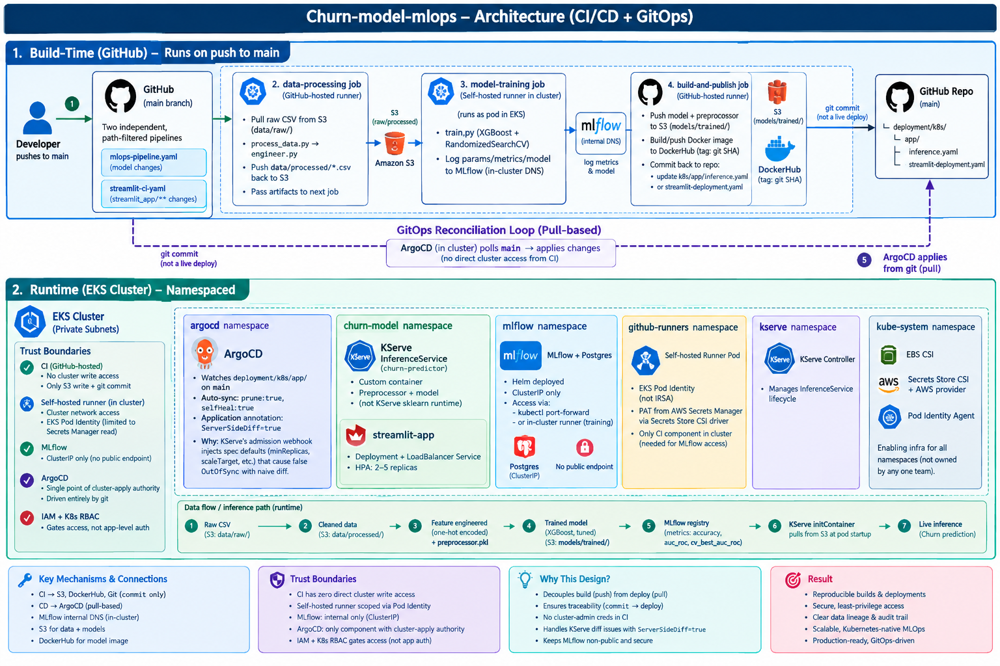
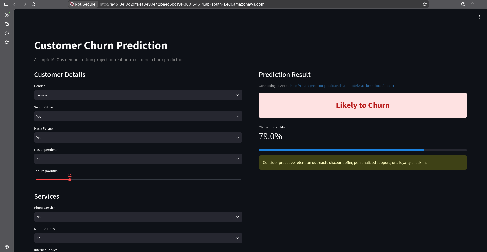

# Churn-Model-MLOps: Production-Ready Customer Churn Prediction

A **portfolio-grade MLOps project** demonstrating end-to-end machine learning operations: from data ingestion through model training, containerization, GitOps-driven continuous deployment, and real-time inference serving on AWS EKS.

**TL;DR:** Push code → GitHub Actions trains + containerizes → git commit → ArgoCD auto-deploys → KServe serves predictions in real time.

---

## 🏗️ Architecture Overview

This project separates **Build-Time (CI/CD)** from **Runtime (Kubernetes)** via a GitOps reconciliation loop — CI is push-based (GitHub Actions), CD is pull-based (ArgoCD). This ensures traceable, auditable deployments and eliminates direct cluster-admin access from the build pipeline.

### High-Level Architecture Diagram



**Key architectural highlights:**
- **Build-Time**: Data processing (hosted runner) → Model training (self-hosted runner, in-cluster for MLflow access) → Docker build → Manifest commit
- **GitOps Bridge**: CI's last act is a git commit; ArgoCD watches the repo and applies changes (pull-based, no CI credential access to cluster)
- **Runtime**: EKS namespaced deployment with KServe (model serving), ArgoCD (continuous sync), MLflow (experiment tracking), and Streamlit UI
- **Trust Boundaries**: CI has S3 + git commit access only; self-hosted runner is scoped via EKS Pod Identity; ArgoCD is the single point with cluster-apply authority

---

## 📋 Infrastructure Setup

Everything below `kube-system` is cluster infrastructure (shared, not managed by ArgoCD). Everything in `churn-model` and `argocd` namespaces is application-specific and ArgoCD-managed.

### Cluster Components Inventory

| Namespace | Component | Purpose | Access Model |
|-----------|-----------|---------|--------------|
| `argocd` | ArgoCD server + repo-server + app-controller | GitOps: polls `main`, auto-applies deployment/k8s/app/ | Pull-based, internal |
| `churn-model` | KServe InferenceService (churn-predictor) | Model serving: custom container (preprocessor → model) | LoadBalancer (for API calls from Streamlit) |
| `churn-model` | Streamlit Deployment + LoadBalancer Service | UI for predictions | LoadBalancer (NLB hostname, no domain) |
| `mlflow` | MLflow + Postgres | Experiment tracking, model registry | ClusterIP only (internal access via kubectl port-forward) |
| `github-runners` | Self-hosted runner pod | CI job execution inside cluster (needed for MLflow DNS access) | Pod Identity (IRSA) |
| `kserve` | KServe controller-manager | Manages InferenceService lifecycle | Internal |
| `kube-system` | EBS CSI, Secrets Store CSI, Pod Identity agent | Storage and identity infrastructure | Kernel-level |

### Pre-Deployment Checklist

```bash
# 1. Create EKS cluster with Pod Identity enabled
# (AWS-managed auth, avoids IRSA complexity — see docs/POD_IDENTITY_SETUP.txt)

# 2. Install storage/identity drivers (already baked into most EKS AMIs, but verify):
kubectl get ds -n kube-system | grep -E "ebs-csi|csi-secrets-store|pod-identity"

# 3. Install cluster-wide controllers (apply once, not managed by ArgoCD):
kubectl apply -f deployment/k8s/infra/sc.yml           # StorageClass
kubectl apply -f deployment/k8s/infra/cluster-issuer*.yaml  # cert-manager issuers
kubectl apply -f deployment/k8s/infra/github-runner.yaml    # Self-hosted runner

# 4. Install KServe (one-time setup)
kubectl apply -f https://github.com/kserve/kserve/releases/download/v0.11.0/kserve.yaml

# 5. Install ArgoCD (one-time setup)
kubectl create namespace argocd
kubectl apply -n argocd -f https://raw.githubusercontent.com/argoproj/argo-cd/stable/manifests/install.yaml

# 6. Deploy the app (ArgoCD now owns it)
kubectl apply -f deployment/argocd/application.yaml
```

### AWS Permissions (Pod Identity Binding)

The self-hosted runner pod needs limited S3 + Secrets Manager access:

```bash
# Create IAM role
aws iam create-role --role-name github-runner-role --assume-role-policy-document '{
  "Version": "2012-10-17",
  "Statement": [{
    "Effect": "Allow",
    "Principal": {"Service": "pods.eks.amazonaws.com"},
    "Action": ["sts:AssumeRole", "sts:TagSession"]
  }]
}'

# Attach policy
aws iam put-role-policy --role-name github-runner-role --policy-name github-runner-policy --policy-document '{
  "Version": "2012-10-17",
  "Statement": [
    {"Effect": "Allow", "Action": "s3:*", "Resource": "arn:aws:s3:::YOUR-BUCKET/*"},
    {"Effect": "Allow", "Action": "secretsmanager:GetSecretValue", "Resource": "*"}
  ]
}'

# Create Pod Identity association
aws eks create-pod-identity-association \
  --cluster-name YOUR-CLUSTER \
  --namespace github-runners \
  --service-account sa-github-runner \
  --role-arn arn:aws:iam::ACCOUNT:role/github-runner-role
```

---

## ⚙️ Application Configuration

This section covers what **ArgoCD manages** (everything in `deployment/k8s/app/`) vs. **what you configure manually** (cluster infra, secrets, variables).

### ArgoCD-Managed Manifests (`deployment/k8s/app/`)

#### `inference.yaml` — KServe InferenceService

```yaml
# Key points:
# 1. Custom container (not KServe's native sklearn runtime)
#    → Allows preprocessing step (preprocessor.pkl) before model
# 2. initContainer pulls model + preprocessor from S3 at pod startup
# 3. Image tag updated by GitHub Actions CI (git commit)
# 4. ConfigMap for S3 paths (MODEL_S3_URI, PREPROCESSOR_S3_URI)
```

**Why not KServe's native sklearn runtime?**
KServe's native runtimes (`model:` + `runtime:`) inject their own CLI args (`--model_name=...`) that our FastAPI container doesn't understand. Custom `containers:` field bypasses that limitation and gives us full control over preprocessing logic.

#### `streamlit-deployment.yaml` — UI Frontend

```yaml
# Deployment: 2-5 replicas, auto-scaled via HPA
# Service: LoadBalancer (direct NLB access via hostname, no domain required)
# ConfigMap: API_URL (http://churn-predictor-predictor.churn-model.svc.cluster.local)
#            (note: KServe appends "-predictor" suffix to Service name)
```

#### `serviceaccount.yaml` — Pod Identity Binding

```bash
# Before deploying, create the Pod Identity association:
kubectl apply -f deployment/k8s/app/serviceaccount.yaml  # Creates namespace + SA
# Then register the association (see AWS Permissions section above)
```

### Manual (Non-ArgoCD) Infrastructure (`deployment/k8s/infra/`)

- `github-runner.yaml` — Self-hosted runner (Pod Identity + access to MLflow)
- `cluster-issuer*.yaml` — cert-manager issuers (Let's Encrypt, ZeroSSL)
- `sc.yml` — EBS-backed StorageClass for persistent data

**Why separate from ArgoCD?** These are cluster-wide resources; applying them multiple times is idempotent, but they don't change per app deployment. Keep them manual to avoid accidental overwrites.

### ArgoCD Application Configuration

**File:** `deployment/argocd/application.yaml`

```yaml
apiVersion: argoproj.io/v1alpha1
kind: Application
metadata:
  name: churn-model
  annotations:
    argocd.argoproj.io/compare-options: ServerSideDiff=true
    # Why ServerSideDiff? KServe's admission webhook injects defaults
    # (minReplicas, scaleTarget, containerConcurrency) that a naive text
    # diff misreads as drift. Server-side diff uses the API server's
    # dry-run, accounting for webhook-injected fields properly.
spec:
  source:
    repoURL: https://github.com/rakarunaesh/Churn-model-mlops
    targetRevision: main
    path: deployment/k8s/app  # Only app manifests, not infra
  syncPolicy:
    automated:
      prune: true    # Delete resources removed from git
      selfHeal: true # Correct drift (non-git changes revert)
```

### Required GitHub Secrets & Variables

**Secrets** (Settings → Secrets and variables → Actions → Secrets):
- `AWS_ACCESS_KEY_ID` — S3 + model artifact access
- `AWS_SECRET_ACCESS_KEY` — S3 + model artifact access
- `DOCKERHUB_TOKEN` — Docker image push
- `GITHUB_TOKEN` — Built-in, for git commit (no configuration needed)

**Variables** (Settings → Secrets and variables → Actions → Variables):
- `AWS_REGION` — e.g., `ap-south-1`
- `S3_BUCKET` — e.g., `mlops-bucket`
- `DOCKERHUB_USERNAME` — e.g., `rakarun`
- `MLFLOW_TRACKING_URI` — e.g., `http://mlflow-mlflow.mlflow.svc.cluster.local:5000`

### S3 Bucket Layout

```
s3://YOUR-BUCKET/
├── data/
│   ├── raw/
│   │   └── WA_Fn-UseC_-Telco-Customer-Churn.csv
│   └── processed/
│       ├── cleaned_churn_data.csv
│       └── featured_churn_data.csv
└── models/
    └── trained/
        ├── churn_model.pkl
        └── preprocessor.pkl
```

---

## 🚀 CI/CD Pipeline

### Trigger: Push to `main`

Two **independent, path-filtered** workflows run:

#### 1. `mlops-pipeline.yaml` — Model Training & Deployment

Runs when any non-`streamlit_app/**` files change:

```
GitHub (main) 
  ↓
data-processing (hosted runner)
  ├─ Pull raw CSV from S3
  ├─ Clean (process_data.py)
  ├─ Feature engineer (engineer.py)
  ├─ Push cleaned/featured CSV back to S3
  └─ Pass artifacts to next job
  ↓
model-training (self-hosted runner, in-cluster)
  ├─ Download processed data
  ├─ Train XGBoost + RandomizedSearchCV
  ├─ Log to MLflow (in-cluster DNS)
  ├─ Upload model + preprocessor as artifacts
  └─ Pass artifacts to next job
  ↓
build-and-publish (hosted runner)
  ├─ Download trained model + preprocessor
  ├─ Push to S3 (models/trained/)
  ├─ Build Docker image (api/Dockerfile)
  ├─ Push to DockerHub (tag: git SHA)
  ├─ Patch deployment/k8s/app/inference.yaml with new image
  └─ Commit back to main (triggers ArgoCD)
  ↓
ArgoCD (polling every 3 min)
  └─ Detects commit, applies inference.yaml (KServe re-pulls new image)
```

#### 2. `streamlit-ci.yaml` — UI Deployment

Runs only on `streamlit_app/**` changes:

```
GitHub (main, streamlit_app/** changed)
  ↓
build-and-push (hosted runner)
  ├─ Build Streamlit image (tag: git SHA)
  ├─ Push to DockerHub
  ├─ Patch deployment/k8s/app/streamlit-deployment.yaml
  └─ Commit back to main
  ↓
ArgoCD
  └─ Detects commit, applies streamlit-deployment.yaml (Deployment rolls new pod)
```

### Why Self-Hosted Runner for Training?

MLflow is deployed **internal-only** (ClusterIP, no external endpoint). GitHub-hosted runners have no network path to reach in-cluster services. A self-hosted runner pod *inside the cluster* can reach MLflow via Kubernetes DNS (`mlflow-mlflow.mlflow.svc.cluster.local:5000`).

**Trade-off:** You manage the runner pod (VM cost, updates), but you get direct cluster network access for internal services.

---

## 📊 Model Training

**Algorithm:** XGBoost with RandomizedSearchCV hyperparameter tuning (20 iterations, 5-fold CV, optimizing AUC-ROC)

**Imbalance Handling:** `scale_pos_weight` computed from training split (~2.7x, since churn is ~27% positive) — tells XGBoost to weight the minority class instead of optimizing raw accuracy

**MLflow Logging:**
- `accuracy`, `auc_roc` — test set metrics
- `cv_best_auc_roc` — cross-validated best score
- All hyperparameters: `n_estimators`, `max_depth`, `learning_rate`, `subsample`, `colsample_bytree`, `min_child_weight`
- Model registered as `churn-predictor` in MLflow registry

**Local Baseline (before MLOps):**
- RandomForest (untuned): 78.7% accuracy, 0.819 AUC-ROC
- XGBoost (tuned): Expected ~82-85% accuracy, 0.85+ AUC-ROC

---

## 📦 Data & Model Versioning with DVC

**Data Version Control (DVC)** tracks datasets and models outside of git, storing them in S3 while keeping lightweight `.dvc` metadata files in git. This separates large binary artifacts (data, models) from code while maintaining full lineage and reproducibility.

### Why DVC?

| Scenario | Without DVC | With DVC |
|----------|------------|----------|
| Store 500MB dataset | Bloats git repo | `.dvc` file (100 bytes) + S3 remote |
| Reproduce old model | "Which data version?" | `dvc checkout <commit-hash>` pulls exact data |
| Compare runs | Manual S3 folder navigation | `dvc metrics diff <branch1> <branch2>` |
| CI/CD artifact passing | GitHub Actions artifacts (expire) | `dvc push/pull` persists across runs |

### DVC Setup

#### 1. Initialize DVC in Your Repository

```bash
cd churn-model-mlops
dvc init
git add .dvc .gitignore
git commit -m "Initialize DVC for data/model versioning"
```

#### 2. Configure S3 as Remote Storage

```bash
# Add S3 remote (replace with your bucket)
dvc remote add -d myremote s3://YOUR-BUCKET/dvc-storage

# Verify config (stored in .dvc/config)
dvc remote list

# Optional: Set up S3 credentials (if not using IAM/Pod Identity)
dvc remote modify myremote --local access_key_id YOUR_KEY
dvc remote modify myremote --local secret_access_key YOUR_SECRET
```

The `.dvc/config` should look like:

```yaml
[core]
    autostage = true
[remote "myremote"]
    url = s3://YOUR-BUCKET/dvc-storage
```

#### 3. Track Datasets with DVC

```bash
# Track raw dataset
dvc add data/raw/WA_Fn-UseC_-Telco-Customer-Churn.csv
git add data/raw/WA_Fn-UseC_-Telco-Customer-Churn.csv.dvc data/raw/.gitignore
git commit -m "Track raw Telco dataset with DVC"

# Track processed datasets (after running process_data.py + engineer.py)
dvc add data/processed/cleaned_churn_data.csv
dvc add data/processed/featured_churn_data.csv
git add data/processed/*.dvc data/processed/.gitignore
git commit -m "Track processed data with DVC"

# Push to S3 remote
dvc push
```

#### 4. Track Models with DVC

```bash
# After training, track the trained model + preprocessor
dvc add models/trained/churn_model.pkl
dvc add models/trained/preprocessor.pkl
git add models/trained/*.dvc models/trained/.gitignore
git commit -m "Track trained model and preprocessor with DVC"

# Push to S3
dvc push
```

### DVC in CI/CD Pipeline

**Current Pipeline (without explicit DVC steps):**
The workflows already push models/data to S3 via `aws s3 cp`. You can enhance this with DVC:

```yaml
# In .github/workflows/mlops-pipeline.yaml, after model-training job:

build-and-publish:
  needs: model-training
  runs-on: ubuntu-latest
  steps:
    - name: Checkout code
      uses: actions/checkout@v3
      with:
        fetch-depth: 0  # Full history for DVC

    - name: Install DVC
      run: |
        pip install dvc dvc-s3

    - name: Configure DVC remote
      env:
        AWS_ACCESS_KEY_ID: ${{ secrets.AWS_ACCESS_KEY_ID }}
        AWS_SECRET_ACCESS_KEY: ${{ secrets.AWS_SECRET_ACCESS_KEY }}
      run: |
        dvc remote add -d myremote s3://YOUR-BUCKET/dvc-storage

    - name: Download trained model
      uses: actions/download-artifact@v4
      with:
        name: trained-model
        path: models/trained/

    - name: Track model with DVC (optional, if you prefer DVC over raw S3)
      run: |
        dvc add models/trained/churn_model.pkl models/trained/preprocessor.pkl
        git config --local user.email "action@github.com"
        git config --local user.name "GitHub Action"
        git add models/trained/*.dvc
        git commit -m "Update DVC model version [skip ci]" || echo "No changes"
        git push

    # ... rest of build steps ...
```

### Working with DVC Locally

```bash
# Pull all tracked data/models from S3
dvc pull

# Pull specific files
dvc pull data/raw/WA_Fn-UseC_-Telco-Customer-Churn.csv.dvc
dvc pull models/trained/churn_model.pkl.dvc

# Reproduce pipeline (if you add dvc.yaml)
dvc repro

# Check what changed between commits
dvc diff HEAD~1

# Check metrics across branches
dvc metrics diff main training-experiment

# See data lineage
dvc dag
```

### DVC + MLflow Integration

MLflow already logs models to its registry. **DVC is complementary** — use DVC for:
- **Raw/processed datasets** (immutable versions tied to git commits)
- **Model artifacts** (as a backup to MLflow; S3-native)

Use MLflow for:
- **Experiment metrics** (accuracy, AUC, hyperparameters)
- **Run tracking** (reproducibility, parameter sweeps)
- **Model registry** (version promotion, staging → production)

**Example workflow:**
1. Raw CSV → DVC tracked
2. `process_data.py` → Cleaned CSV → DVC tracked
3. `engineer.py` → Featured CSV → DVC tracked
4. `train.py` → Model + MLflow logged + DVC tracked
5. GitHub Actions → Pushes to S3 (via DVC or `aws s3 cp`)

### Project Structure with DVC

```
churn-model-mlops/
├── .dvc/
│   ├── config           # DVC remote configuration (S3 endpoint, credentials)
│   └── .gitignore
├── data/
│   ├── raw/
│   │   ├── WA_Fn-UseC_-Telco-Customer-Churn.csv      # Large file (ignored)
│   │   └── WA_Fn-UseC_-Telco-Customer-Churn.csv.dvc  # DVC metadata (tracked in git)
│   └── processed/
│       ├── cleaned_churn_data.csv
│       ├── cleaned_churn_data.csv.dvc
│       ├── featured_churn_data.csv
│       └── featured_churn_data.csv.dvc
├── models/
│   └── trained/
│       ├── churn_model.pkl
│       ├── churn_model.pkl.dvc
│       ├── preprocessor.pkl
│       └── preprocessor.pkl.dvc
├── .gitignore           # Updated by DVC to ignore *.pkl, *.csv (except .dvc files)
└── dvc.yaml            # (Optional) Define pipeline stages
```

### DVC Pipeline Definition (Advanced)

For reproducible pipelines, create `dvc.yaml`:

```yaml
stages:
  process:
    cmd: python process_data.py --input data/raw/WA_Fn-UseC_-Telco-Customer-Churn.csv --output data/processed/cleaned_churn_data.csv
    deps:
      - data/raw/WA_Fn-UseC_-Telco-Customer-Churn.csv
      - process_data.py
    outs:
      - data/processed/cleaned_churn_data.csv

  engineer:
    cmd: python engineer.py --input data/processed/cleaned_churn_data.csv --output data/processed/featured_churn_data.csv --preprocessor models/trained/preprocessor.pkl
    deps:
      - data/processed/cleaned_churn_data.csv
      - engineer.py
    outs:
      - data/processed/featured_churn_data.csv
      - models/trained/preprocessor.pkl

  train:
    cmd: python train.py
    deps:
      - data/processed/featured_churn_data.csv
      - train.py
    outs:
      - models/trained/churn_model.pkl
    metrics:
      - metrics.json:
          cache: false
```

Then reproduce with:

```bash
dvc repro  # Runs all stages, skips unchanged steps
```

---

## 🎯 Live Demo

### Streamlit UI Screenshot



The UI accepts 19 Telco customer fields (gender, tenure, monthly charges, internet service, contract type, etc.) and returns:
- **Prediction:** "Likely to Churn" or "Likely to Stay"
- **Probability:** 0-100% confidence
- **Business Action:** Retention recommendation

**Access:** 
```bash
# Get the LoadBalancer hostname (or IP)
kubectl get svc -n churn-model streamlit-app
# Open: http://<NLB-HOSTNAME>
```

**Example High-Churn Customer:**
- Senior citizen, no partner, low tenure (3 months)
- Fiber optic internet, high monthly charges
- No long-term contract
- **Predicted churn probability:** 79% → Recommend immediate outreach

---

## 🔍 Monitoring & Debugging

### Check ArgoCD Sync Status

```bash
kubectl get application -n argocd
kubectl describe application churn-model -n argocd

# Watch for OutOfSync events
# Note: If InferenceService shows perpetual OutOfSync, verify
# argocd.argoproj.io/compare-options: ServerSideDiff=true annotation
# is set (handles KServe's webhook-injected defaults)
```

### MLflow Access (Internal-Only)

```bash
# Tunnel through EKS API server (IAM-authenticated)
kubectl port-forward svc/mlflow-mlflow -n mlflow 5000:5000

# Open browser: http://localhost:5000
# View experiments, compare runs, check model metrics
```

### Check GitHub Runner Pod

```bash
kubectl get pods -n github-runners
kubectl logs -n github-runners -f <pod-name>

# Verify Pod Identity credentials are available
kubectl exec -it -n github-runners <pod-name> -- \
  curl http://169.254.169.254/latest/meta-data/iam/security-credentials/
```

### KServe Inference Service Status

```bash
kubectl get inferenceservice -n churn-model
kubectl describe inferenceservice churn-predictor -n churn-model
kubectl logs -n churn-model -l app=churn-predictor-predictor -f
```

---

## 🔐 Security & Design Decisions

| Decision | Why |
|----------|-----|
| **Pod Identity over IRSA** | Kubernetes native (no separate IAM role creation), built into EKS |
| **Self-hosted runner in-cluster** | MLflow is internal-only; hosted runners can't reach it |
| **Git commits instead of direct deploys** | Traceable audit trail; all deployments come from git (GitOps principle) |
| **ServerSideDiff=true on Application** | KServe's webhook injects defaults; text diff alone misreads as drift |
| **Secrets Store CSI driver** | GitHub PAT → AWS Secrets Manager → pod volume (no secrets in manifests) |
| **LoadBalancer over Ingress** | nginx-ingress-controller requires explicit host on every rule; LoadBalancer works without a domain |
| **Streamlit as separate Deployment** | Decoupled from model serving; can scale UI independently |

---

## 📈 Future Enhancements

- **Model monitoring:** Drift detection (data/prediction distribution shifts)
- **A/B testing:** Route subset of traffic to new model versions
- **Canary deployments:** Gradual rollout via weighted traffic splitting
- **Feature store:** Centralized feature engineering (e.g., Tecton, Feast)
- **Automated retraining:** Trigger on data drift or performance degradation

---

## 🛠️ Local Development

### Run Locally (without Kubernetes)

```bash
# Install dependencies
pip install -r requirements.txt

# Process data
python process_data.py --input data/raw/WA_Fn-UseC_-Telco-Customer-Churn.csv --output data/processed/cleaned_churn_data.csv
python engineer.py --input data/processed/cleaned_churn_data.csv --output data/processed/featured_churn_data.csv --preprocessor models/trained/preprocessor.pkl

# Train model
python train.py

# Test API
cd api && pip install -r requirements.txt && python -m uvicorn api:app --reload

# In another terminal, test Streamlit
cd streamlit_app && streamlit run app.py --logger.level=debug
```

### MLflow on Localhost

```bash
# Start MLflow server (after setting MLFLOW_TRACKING_URI=http://localhost:5000)
mlflow server --host 0.0.0.0 --port 5000
```

---

## 📚 Files Reference

| File | Purpose |
|------|---------|
| `process_data.py` | Clean raw CSV (drop customerID, coerce TotalCharges, map Churn Yes/No → 0/1) |
| `engineer.py` | One-hot encode 15 categorical columns, save preprocessor.pkl |
| `train.py` | XGBoost + RandomizedSearchCV, log to MLflow |
| `api/api.py` | FastAPI inference server (load preprocessor + model, accept raw customer features) |
| `api/Dockerfile` | Multi-stage: builder → slim runtime, baked-in fallback models for local testing |
| `streamlit_app/app.py` | Streamlit form (19 fields) → HTTP POST to API → display prediction |
| `.github/workflows/mlops-pipeline.yaml` | 3-job CI/CD: data-processing → model-training → build-and-publish |
| `.github/workflows/streamlit-ci.yaml` | Streamlit image build (path-filtered on `streamlit_app/**`) |
| `deployment/k8s/app/*.yaml` | ArgoCD-managed manifests (InferenceService, Deployment, ServiceAccount) |
| `deployment/k8s/infra/*.yaml` | Cluster-wide infrastructure (runner, issuers, StorageClass) |
| `deployment/argocd/application.yaml` | ArgoCD Application CRD (watches `deployment/k8s/app`, syncs automatically) |
| `deployment/mlflow/helm/` | MLflow Helm chart (Postgres backend, S3 artifact storage) |
| `.dvc/config` | DVC remote configuration (S3 endpoint, bucket path) — commit to git |
| `.dvc/.gitignore` | Auto-generated, tells git to ignore actual data/model files |
| `dvc.yaml` | (Optional) Defines reproducible pipeline stages and dependencies |
| `data/raw/*.dvc`, `data/processed/*.dvc` | DVC metadata files tracking dataset versions |
| `models/trained/*.dvc` | DVC metadata files tracking model + preprocessor versions |

---

## 🎓 Learning Outcomes

After this project, you'll understand:
- ✅ **ML Lifecycle:** Data → Feature Engineering → Model Training → Serving → Monitoring
- ✅ **CI/CD:** Multi-stage pipelines, artifact passing, environment-specific builds
- ✅ **GitOps:** Pull-based deployments, declarative infrastructure, audit trails via git
- ✅ **Kubernetes:** Namespaces, Deployments, Services, Custom Resources (CRDs), Pod Identity
- ✅ **MLOps:** Model versioning (MLflow + DVC), data versioning, experiment tracking, reproducible training
- ✅ **Data Version Control:** DVC for datasets and models, S3 remotes, pipeline reproducibility
- ✅ **Cloud AWS:** S3, EKS, IAM/Pod Identity, Secrets Manager
- ✅ **Model Serving:** KServe, inference containerization, scaling via HPA

---

## 📞 Support

For questions or issues:
- Check `docs/POD_IDENTITY_SETUP.txt` for AWS-specific setup
- Review `.github/workflows/` for CI/CD logic
- Inspect `deployment/argocd/application.yaml` for GitOps config

**Remember:** Everything in git is the source of truth. If something drifts on the cluster, ArgoCD will notice and auto-correct (via `selfHeal: true`).
